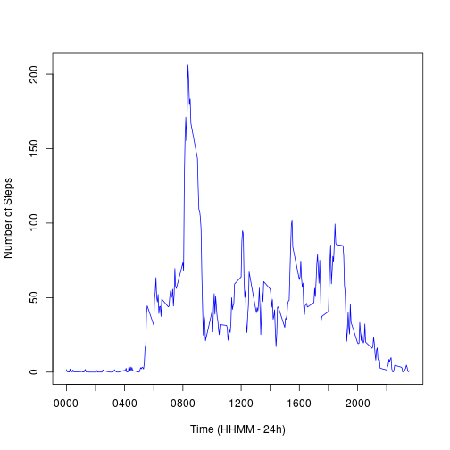

Reproducible Research - Peer Assignment 1
========================================================
### Tiago T. V. Vinhoza
  
### June 9, 2014
  
  It is now possible to collect a large amount of data about personal movement using activity monitoring devices such as a Fitbit, Nike Fuelband, or Jawbone Up. These type of devices are part of the *quantified self movement* a group of enthusiasts who take measurements about themselves regularly to improve their health, to find patterns in their behavior, or because they are tech geeks. But these data remain under-utilized both because the raw data are hard to obtain and there is a lack of statistical methods and software for processing and interpreting the data.

This assignment makes use of data from a personal activity monitoring device. This device collects data at 5 minute intervals through out the day. The data consists of two months of data from an anonymous individual collected during the months of October and November, 2012 and include the number of steps taken in 5 minute intervals each day.

## Data

The variables included in this dataset are:
  
  steps: Number of steps taking in a 5-minute interval (missing values are coded as NA)

date: The date on which the measurement was taken in YYYY-MM-DD format

interval: Identifier for the 5-minute interval in which measurement was taken

The dataset was loaded as follows. 


```r
dataset <- read.table(file = "activity.csv", sep = ",", head = TRUE)
```


We first checked what are the types of the variables included in the dataset

```r
str(dataset)
```

```
## 'data.frame':	17568 obs. of  3 variables:
##  $ steps   : int  NA NA NA NA NA NA NA NA NA NA ...
##  $ date    : Factor w/ 61 levels "2012-10-01","2012-10-02",..: 1 1 1 1 1 1 1 1 1 1 ...
##  $ interval: int  0 5 10 15 20 25 30 35 40 45 ...
```


As we can see, the variable date was loaded as *factor*. We need to convert it to *date*. This can be done by using the following command:
  
  ```r
  dataset$date <- as.Date(as.character(dataset$date))
  str(dataset)
  ```
  
  ```
  ## 'data.frame':	17568 obs. of  3 variables:
  ##  $ steps   : int  NA NA NA NA NA NA NA NA NA NA ...
  ##  $ date    : Date, format: "2012-10-01" "2012-10-01" ...
  ##  $ interval: int  0 5 10 15 20 25 30 35 40 45 ...
  ```


We now sum up all the steps taken in each unique date. So each component of *total_steps_per_day* has a unique date and the total number of steps taken on that date. To get the mean and the median, we just apply the correspondings commands:
  
  ```r
  total_steps_per_day <- sapply(split(dataset$steps, dataset$date), sum, na.rm = TRUE)
  mean(total_steps_per_day)
  ```
  
  ```
  ## [1] 9354
  ```
  
  ```r
  median(total_steps_per_day)
  ```
  
  ```
  ## [1] 10395
  ```

Here is an histogram:
  
  ```r
  hist(total_steps_per_day, breaks = 10)
  ```
  
   


Now we calculate the average number steps in each 5-minute interval across the date. Since each date has 288 5-minute intervals, the resulting *avg_steps* will have 288 rows with each row representing one 5-minute interval. The code to plot is shown below:
  
  ```r
  avg_steps <- sapply(split(dataset$steps, dataset$interval), mean, na.rm = TRUE)
  time_int <- unique(dataset$interval)
  time2 <- sprintf("%04d", time_int)
  plot(time_int, avg_steps, type = "l", xaxt = "n", col = "blue", ylab = "Number of Steps", 
      xlab = "Time (HHMM - 24h)")
  axis(1, at = seq(0, 2355, 200), labels = time2[seq(1, 288, 24)])
  ```
  
   


### Dealing with Missing Values
Before proceeding, we shall create a new dataset in which we will operate from now on:
  
  ```r
  dataset2 <- dataset
  ```


We now calculate and report the total number of missing values in the dataset (i.e. the total number of rows with NAs). The *summary* command will suffice:
  
  ```r
  summary(dataset2)
  ```
  
  ```
  ##      steps            date               interval   
  ##  Min.   :  0.0   Min.   :2012-10-01   Min.   :   0  
  ##  1st Qu.:  0.0   1st Qu.:2012-10-16   1st Qu.: 589  
  ##  Median :  0.0   Median :2012-10-31   Median :1178  
  ##  Mean   : 37.4   Mean   :2012-10-31   Mean   :1178  
  ##  3rd Qu.: 12.0   3rd Qu.:2012-11-15   3rd Qu.:1766  
  ##  Max.   :806.0   Max.   :2012-11-30   Max.   :2355  
  ##  NA's   :2304
  ```

The output show that all the missing values are in the *steps* column. 

Our strategy for filling in all of the missing values in the dataset will be to use the mean value for the 5-minute interval where the NA occurred. The following code find the missing values in each of the 5-minute intervals and replaces them with the value of *avg_steps* calculated previously.


```r
for (i in 1:length(avg_steps)) {
    idx <- which(is.na(dataset2$steps) & dataset2$interval == time_int[i])
    dataset2$steps[idx] <- avg_steps[i]
}
```


Create a new dataset that is equal to the original dataset but with the missing data filled in.

When we calculate and the mean and median total number of steps taken per day we see that these values differ from the estimates from the first part of the assignment. As the number of NA's was quite large for some of the dates, the impact of imputing missing data was considerable.


```r
total_steps_per_day <- sapply(split(dataset2$steps, dataset$date), sum, na.rm = TRUE)
mean(total_steps_per_day)
```

```
## [1] 10766
```

```r
median(total_steps_per_day)
```

```
## [1] 10766
```

Here is an histogram:

```r
hist(total_steps_per_day, breaks = 10)
```

 


### Are there differences in activity patterns between weekdays and weekends?

To answer this question we create a new factor variable in the dataset with two levels: *weekday* and *weekend* indicating whether a given date is a weekday or weekend day. The following code creates the *day_of_week* column as logical, then convert it to a factor variable and rename the factor levels.

```r
dataset2$day_of_week <- (weekdays(dataset$date) == "Saturday" | weekdays(dataset$date) == 
    "Sunday")
dataset2$day_of_week <- factor(dataset2$day_of_week)
levels(dataset2$day_of_week) <- c("weekday", "weekend")
```


Then we collect the samples for the weekdays and weekends.

```r
weekend_samples <- dataset2[(dataset2$day_of_week == "weekend"), ]
weekdays_samples <- dataset2[(dataset2$day_of_week == "weekday"), ]
```


And plotting them:


```r
# Plot parameters
par(mfrow = c(2, 1))

# Plotting weekend data
avg_weekends <- sapply(split(weekend_samples$steps, weekend_samples$interval), 
    mean, na.rm = TRUE)
time_int <- unique(weekend_samples$interval)
time2 <- sprintf("%04d", time_int)
# First plot
plot(time_int, avg_weekends, type = "l", xaxt = "n", col = "blue", ylab = "Number of Steps", 
    xlab = "Time (HHMM - 24h)")
axis(1, at = seq(0, 2355, 200), labels = time2[seq(1, 288, 24)])
title("Average number of steps on weekends")

# Plotting weekdays data
avg_weekdays <- sapply(split(weekdays_samples$steps, weekdays_samples$interval), 
    mean, na.rm = TRUE)
time <- unique(weekdays_samples$interval)
time2 <- sprintf("%04d", time)
plot(time_int, avg_weekdays, type = "l", xaxt = "n", col = "blue", ylab = "Number of Steps", 
    xlab = "Time (HHMM - 24h)")
axis(1, at = seq(0, 2355, 200), labels = time2[seq(1, 288, 24)])
title("Average number of steps on weekdays")
```

 


